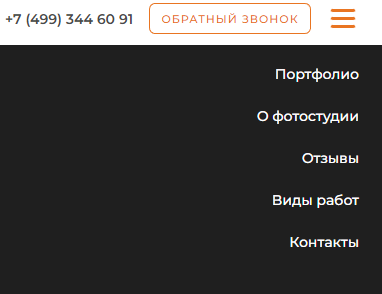
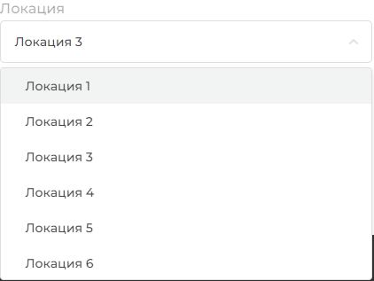
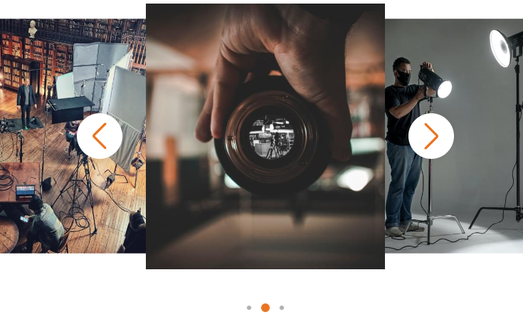
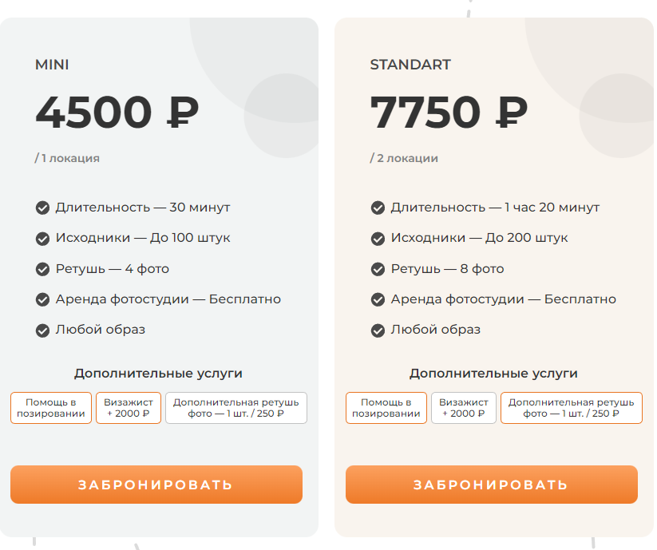
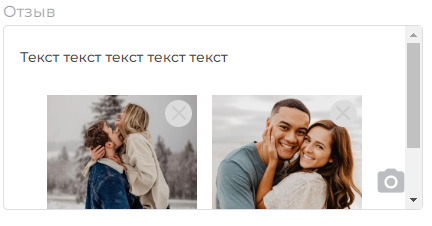

# ADDPHOTO  

---
## [Git pages](https://poshalim.github.io/ADDPHOTO)

---
## Технологии и практики, которые были применены(nt)

* Семантика
* БЭМ
* Адаптивность, доступность и кроссбраузерность
* grid и flex
* SCSS
* gulp

---
## Что было реализовано

* Кастомные селекты.
    * В меню обеспечивающем навигацию по сайту при ширине экрана меньше 970.
    
     
    * В форме для выбора локации. Раздел "Наши локации" - "Выбрать локацию".
    
 
* Модальные окна с различным функционалом - формы, слайдеры.

 
* Слайдер с пагинацией, реализованный с помощью swiper.js.

 
* Изменение стоимости, исходя из выбранных пользователем услуг и их количеством. Раздел "Стоимость фотосессии".

 
* Поле для отзыва с добавлением и удалением изображений. Раздел "Отзывы" - "Добавить отзыв".

---
## Связь
 

